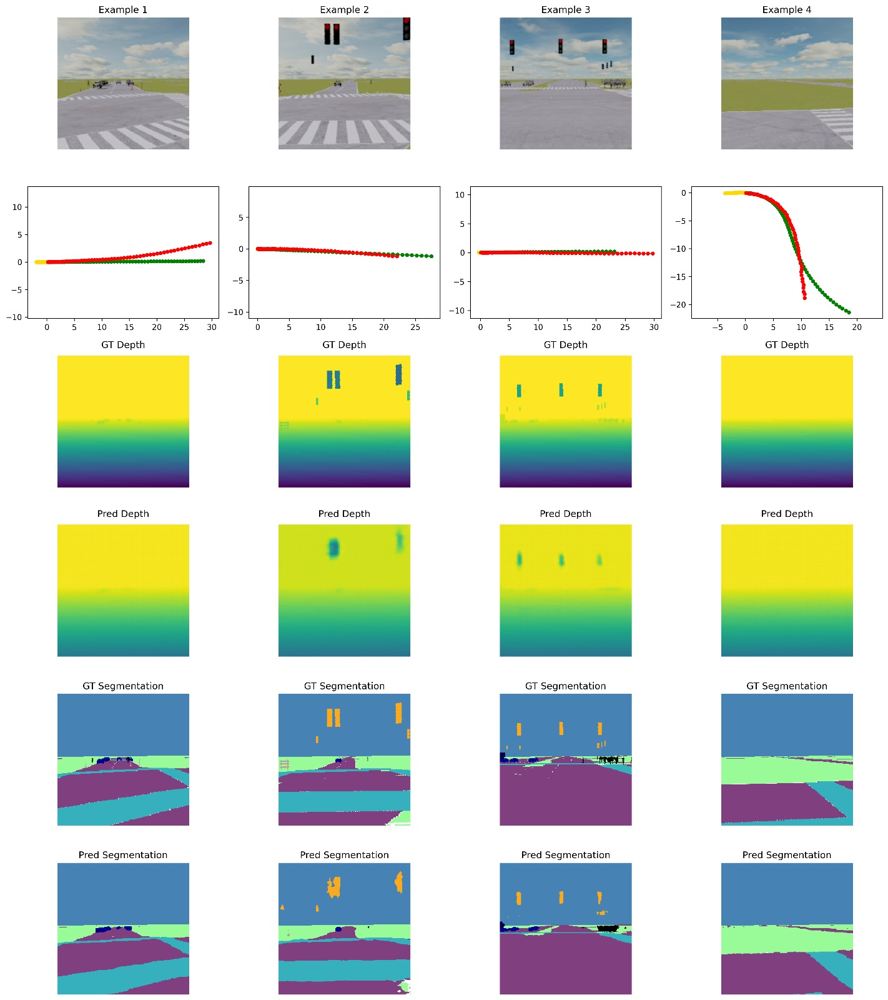

# DLAV Project Submission Part 2
**ADEBeastsLLC** <br>
 Rafael Garcia Bustillos and Jeffrey Yu

## Task

The goal of the second milestone was to incorporate auxiliary tasks for the model to improve performance in predicting future car trajectories. These tasks were depth map prediction and semantic map prediction. From our observations, we were able to achieve better performance with the inclusion of these auxiliary tasks, and the ADE decreased from ~1.90 in Milestone 1 to ~1.55 in Milestone 2. In the following sections, we will describe the inputs, model structure, loss function design, training configuration, and instructions to run the code.

## Inputs: 

```python
camera: ndarray (200, 300, 3)      # RGB image

semantic_label: ndarray (200, 300)           # Semantic segmentation map

depth: ndarray (200, 300, 1),                # Depth image at time step 21

sdc_history_feature: ndarray (21, 3)    # [x, y, heading] from past 21 steps
```
## Outputs:
```python
sdc_future_feature: ndarray (60, 3),      # [x, y, heading] for the next 60 steps
```

## Structure

We designed the architecture with 5 main components:
1. **Pretrained Resnet34 Image feature extractor** <br>
 We use a pretrained Resnet34 model with weights from the Image1K dataset. We want to use a robust and high-performing model to extract image features. We cropped and interpolated the input RGB image, semantic map, and depth map to (224x224) to respect the ResNet input image architecture. To adjust the model to our dataset, we chose to retrain the last ResNet block. We want to incorporate the depth and semantic label losses in the training of the last section of the ResNet, letting the model learn to incorporate the auxiliary losses and the high-level features relevant to our dataset.
2. **History feature extractor** <br>
 We use a 4-layer fully connected MLP to learn relationships between the past locations of the model. This outputs a vector of size 128.
3. **Future Decoder** <br>
 The decoder concatenates the outputs of the history feature extractor with the image encoder. It is a fully connected MLP that uses 2 hidden layers and then outputs a final prediction, which is a vector of size 180. This is then reshaped to the desired shape of [60, 3].
4. **Semantic Label Decoder** <br>
 The semantic label decoder uses a U-Net-like architecture to upsample the feature maps from ResNet. 
5. **Depth Decoder** <br>
 The depth decoder uses a U-Net-like architecture to upsample the feature maps from ResNet. 

## Loss Function Design
The loss consists of 3 components: trajectory loss, depth loss, and semantic map loss.
- For trajectory loss, we used a custom loss criterion to scale the L2 loss of x, y, and heading differently. We chose to scale the heading loss by 4 times to compensate for the magnitude of the difference between the maximum value of the heading and the maximum displacements of the x and y positions. 

- For depth loss, we used an L1 loss between the predicted and true depth map that was scaled before adding to the overall loss. The scale factor was determined heuristically such that it did not dominate nor was it insignificant to the overall loss.

- For semantic loss, we used a Cross-Entropy Loss between the predicted and true semantic maps. For each pixel, the network predicts the class probability. For 15 classes the network outputs with a shape of (Batch, 15, H, W), and it gets compared with the ground truth (Batch, H, W). This was scaled and added to the overall loss, and a similar heuristic for the scaling was applied.

## Training Configuration 
The model was trained on an HPC cluster with a V100 GPU.

We trained using the following configurations:

- Optimizer: Adam
- Learning Rate Scheduler: Cosine annealing with a starting learning rate of 5e-4 and ending learning rate of 5e-5.
- Epochs: 200
- Batch size: 32

We loaded the weights from Milestone 1 for the history feature extractor and future decoder.
Note: We save the best-performing model while training, using the criterion of lowest ADE on the validation. This may not correspond to the final model found at the end of training.

## Code Structure and Instructions
The code is comprised of multiple files structured in the manner below:

```
DLAV/
├── main.py # Entry point for training
├── validate.py # loads a model, visualizes results and calculates validation ADE
├── kaggle.py # prepares csv for kaggle
├── Weights_V1.pth # pretrained weights from Milestone 1 with utils.model.FirstModel
├── Weights_V2.pt # pretrained weights from Milestone 2 with utils.model.DrivingPlanner
├── utils/
│ |── dataset.py # dataset and dataloader for nuPlan
│ ├── logger.py # logging class
│ ├── model.py # model architecture definition
│ └── train.py # training functions
└── run_job.sh # SLURM script for HPC job submission
```
The weight for Milestone 2 can be found at this [link](https://drive.google.com/file/d/1vYNh7XjDubimhLllAMLughQsiTDb3NZw/view?usp=drive_link)
### Environment Config
Install the required packages using the command: ```pip install -r requirements.txt```

### Training
To train the model, run the ```main.py``` file. The training hyperparameters are modified within the main file.

### Visualization and Validation 
To run the model and visualize on the validation set, run the code ```validate.py```. You need to modify the line to load in the desired weights. Below is an image of the visualization of the model outputs.



### Infer  
To generate the ```.csv``` file for submissions, run the file ```kaggle.py```.

## Additional Notes
- We attempted to train with a GRU, but were not able to get an ADE below ~2.5, like in Milestone 1.
- We attempted to use early stopping, with a patience of 10 or less, but found that it was stopping too early, so we just trained to the epochs that we set the session to.
